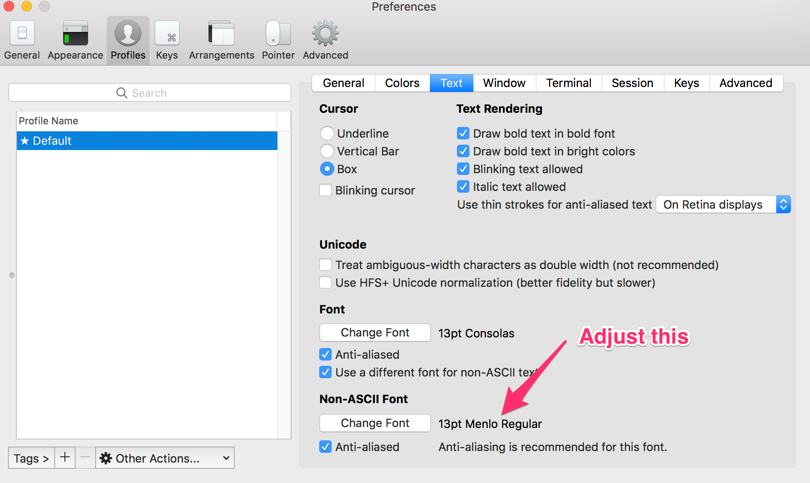
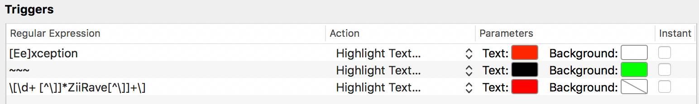
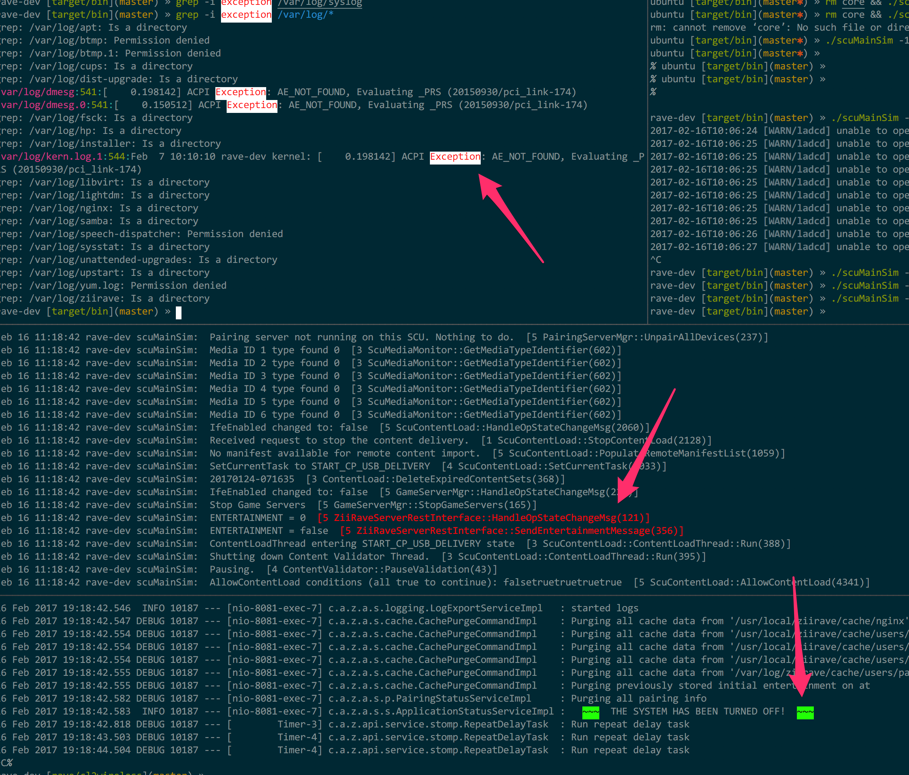
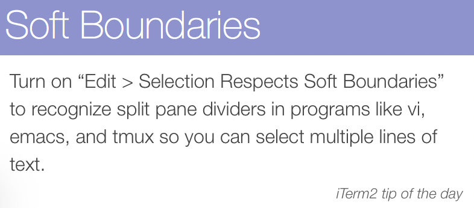
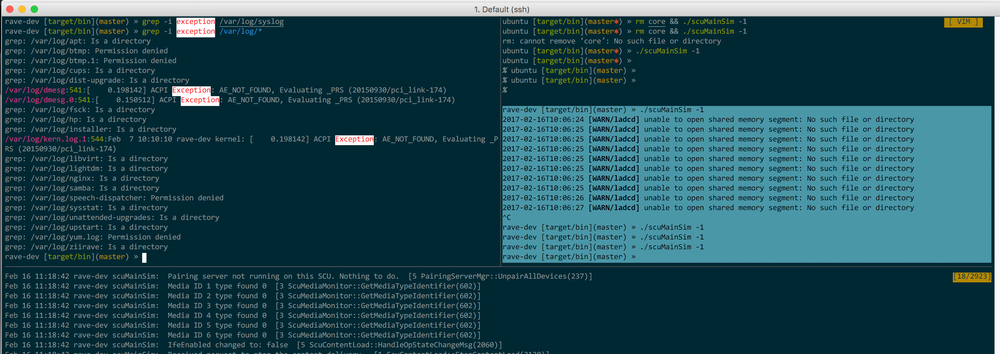

# tmux-config

## Installation
```
cd ~
git clone https://github.com/codisms/tmux-config.git .tmux
cd .tmux
git submodule init
git submodule update --init --recursive
cd ..
ln -s .tmux/tmux.conf .tmux.conf
```

## Notable Options
* tpm
* Uses solarized coloring
* vi copy mode
* resurrect and continuum plugins

## Key Mappings
* Prefix remapped to Ctrl-a
* Most default key mappings disabled
* P-r = reload config
* vi mappings (P-j, P-k, P-l, P-h) for switching panes
* P-Shift-Left/Right = swap windows left/right
* P-| = split horizontal
* P-- = split vertical
* P-Up/Down/Left/Right = resize pane up/down/left/right by 5
* P-Meta-Up/Down/Left/Right = resize pane up/down/left/right by 1
* P-Ctrl-Up/Down/Left/Right = resize pane up/down/left/right by 10

# iTerm2 Tips
## Set border fonts
In the images below, note how the borders between panes are smooth.  Here’s my config for that, but it will likely depend on your system font size:


## Dynamic highlighting
(Profiles->Advanced->Triggers) Here’s my config:


Here’s the result:


## Soft boundaries


Here’s the result:


Note that only the text in the single pane is selected when I use the mouse to select.

